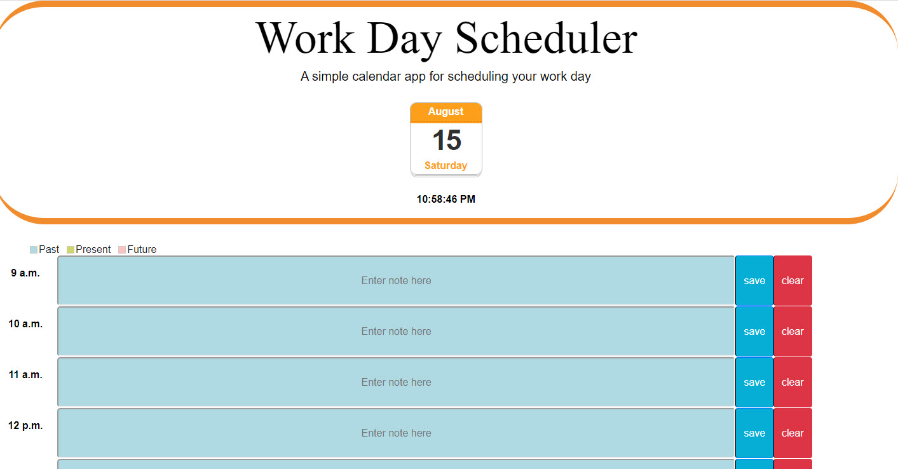

# Workday Scheduler

> This is a simple calendar application that allows the users to save events for each hour of the day starting from 9am - 5pm. This app will run in the browser and feature dynamically updated HTML and CSS powered by jQuery.
https://mtanczos.github.io/WorkDayScheduler/

## Table of contents
* [Acceptance_Criteria](#Acceptance_Criteria)
* [Screenshots](#screenshots)
* [Technologies](#technologies)
* [Acknowledgements](#Acknowledgements)

## Acceptance_Criteria
GIVEN I am using a daily planner to create a schedule
WHEN I open the planner
THEN the current day is displayed at the top of the calendar

WHEN I scroll down
THEN I am presented with timeblocks for standard business hours

WHEN I view the timeblocks for that day
THEN each timeblock is color coded to indicate whether it is in the past, present, or future

WHEN I click into a timeblock
THEN I can enter an event

WHEN I click the save button for that timeblock
THEN the text for that event is saved in local storage

WHEN I refresh the page
THEN the saved events persist

## Screenshots

## Technologies
* Bootstrap 4.5
* HTML5
* CSS3
* jQuery

## Acknowledgements
* Sitepoint.com
 //https://www.sitepoint.com/create-jquery-digital-clock-jquery4u/
* https://www.w3schools.com/jquery/

